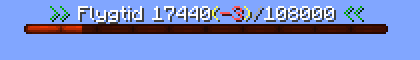

# CMI

## <ins>Flygtid
>---
>  
>När man röstar får man **1h/3600 sekunder** flygtid.  
För att aktivera fly skriver du */fly* och efter det kan du flyga som i creative.  
Man kan som max ha **30h/108000 sekunder** flygtid.  
Den tiden du inte förbrukas sparas
> 
>Om man köper en epic nyckel så kan man vinna "Scroll of flying" som ger dig 2h extra flygtid.
>
>---

## <ins>Hem
>---
>Alla spelare kan ha upp till 5st hem till en början.  
>Om man har EPIC ranken så kan man ha 10 hem.  
>
>Om man vill sätta ett hem så skriver man /sethome och då hamnar hemmet på blocket du står på.  
>
>---

## <ins>Kommandon
*Alla kommandon börjar med /*
>---
>- **fly** | Aktivera flygläget
>- **flightcharge** | Kolla hur mycket flygtid du har
>- **afk** | Växla mellan afk/icke afk
>- **afkcheck (spelare)** | Kolla om någon spelare är afk
>- **back** | Teleportera tillbaka till din senaste plats
>- **balance (namn)** | Kolla hur mycket pengar du eller en spelare har
>- **baltop** | Se listan som visar vem som har mest pengar
>- **donate (spelare) (antal)** | Donera föremålet du har i handen
>- **home (hemnamn)** | Teleportera dig till ditt hem
>- **homes** | En lista på alla hem du kan teleportera dig till med ett klick
>- **sethome (hemnamn) (block|material)** | Sätt ett nytt hem *till exempel: **/sethome hem block** tar blocket du står på som ikon i /homes och **/sethome hem woodenshovel** sätter träspade som ikon*
>- **removehome (hemnamn)** | Ta bort ett hem
>- **ignore (spelare)** | Ignorera en spelare
>- **inv (spelare)** | *invsee* Öppna en spelares förråd
>- **inteminfo** | Visar information om föremålet du har i handen
>- **list** | Visar vilka som är online
>- **me (meddelande)** | Skicka ett specialmeddelande
>- **msg (spelare) (meddelande)** | Skicka ett privat meddelande till en spelare
>- **reply (meddelande)** | Svara på senaste meddelande
>- **note** | Hantera dina anteckningar
>   - **add (meddelande)** | Lägg till en anteckning
>   - **remove (#)** | Ta bort en anteckning
>   - **clear** | Ta bort alla anteckningar
>   - **list** | Få en lista med alla anteckningar
>- **pay (spelare) (summa)** | Skicka pengar till en spelare
>- **ping** | Se vad din ping är
>- **playtime** | Se din speltid
>- **playtimetop** | Se vem som spelat längst
>- **prewards** | Se hur lång tid det är kvar tills nästa belöning kommer
>- **recipe (föremål)** | Sök efter recept för föremål
>- **rt** | Teleportera till en random plats
>- **seen (spelare)** | Kolla när en spelare senast var online
>- **sell** | Sälj det du har i handen
>   - **all** | Sälj allt i ditt förråd som går att sälja
>- **sit** | Sätt dig på blocket
>- **spawn** | Teleportera till spawn
>- **servertime** | Kolla serverns klocka
>- **time** | Se världens tid
>- **tpa (spelare)** | Skicka en teleport-förfrågan
>- **tpaccept (spelare)** | Acceptera en teleport-förfrågan
>- **tpdeny (spelare)** | Förneka en teleport-förfrågan
>- **votetop** | Kolla vem som röstat mest
>- **warp (warpnamn)** | Teleportera till en warp
>- **worth (block/föremål)** | Kolla vad föremålet är värt
>---
