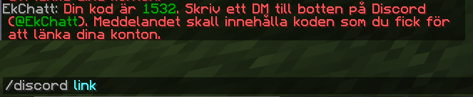
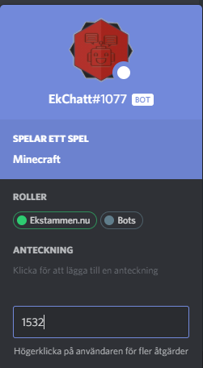
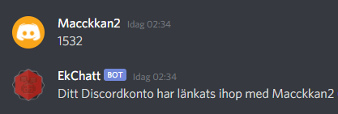

# Discord

## Koppla ihop ditt Discord konto med Minecraft
Genom att koppla ihop dina konton så kommer du få samma namn på discord som du har på servern. Detta hjälper t.ex. staff när du skapar en ticket.

### Så här gör du:  
1. Skriv **/discord link** i chatten  

2. Koden du fick (i detta fall är koden **1532**) skickar du i ett <ins>direkt-meddelande</ins> till **@EkChatt** på discord  

3. Om du skrev rätt kod är dina konton kopplade.  
 